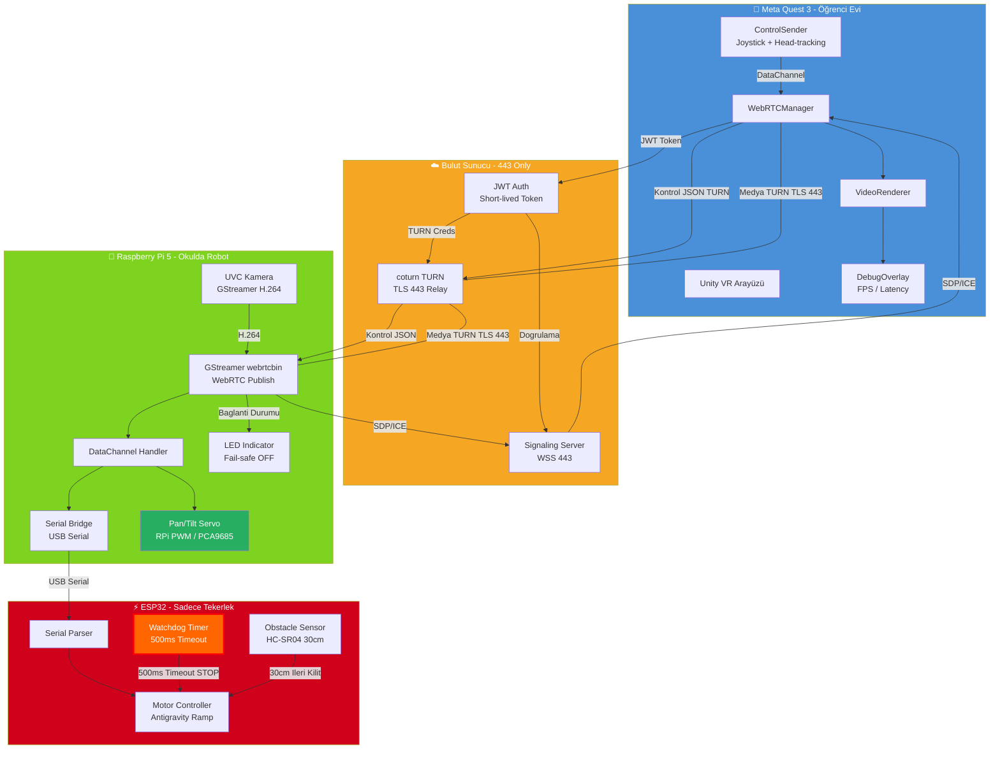
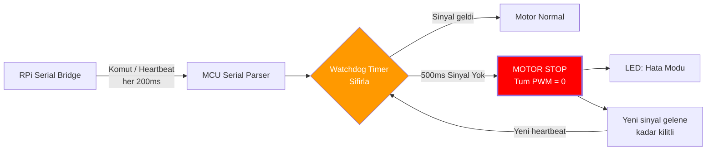
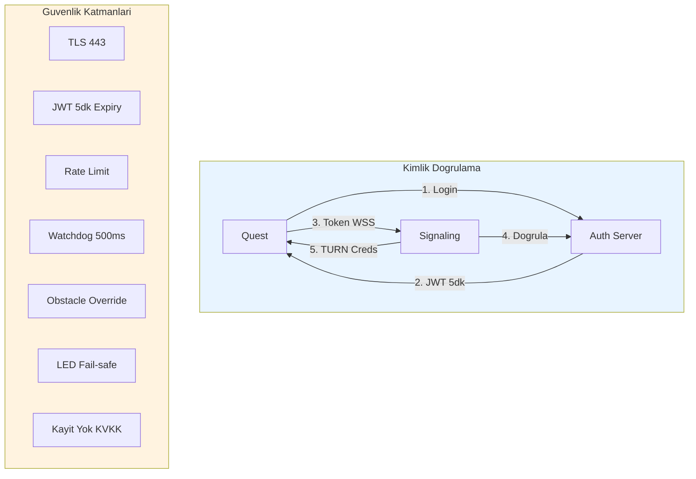
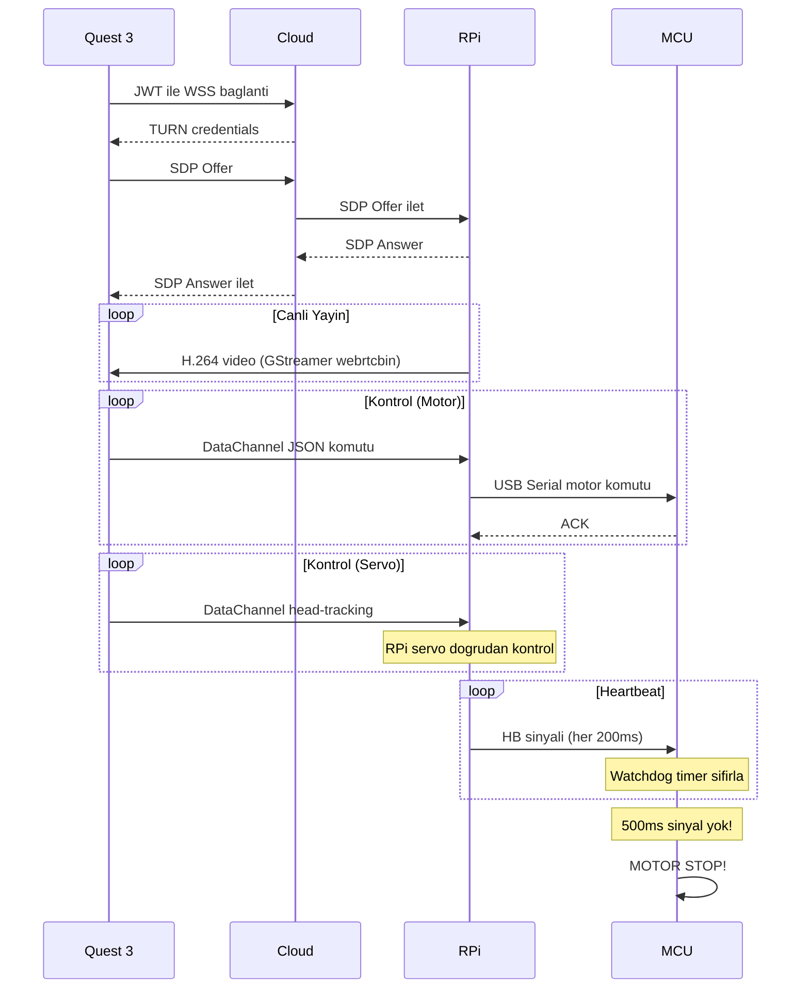

# Akış Şemaları – Mermaid Kaynak Kodları (v2.1)

> Bu dosya tez raporunda kullanılacak akış şemalarını içerir.
> [Mermaid Live Editor](https://mermaid.live/) ile PNG/SVG'ye dönüştürülebilir.
>
> **v2.1 Değişiklikler:** WebRTC → GStreamer webrtcbin, Servo → RPi PWM/PCA9685

## 1. Ana Sistem Akışı

## 2. Watchdog (Ölü Adam Anahtarı) Detay

## 3. Güvenlik Katmanları

## 4. Kontrol Komutu Yaşam Döngüsü

